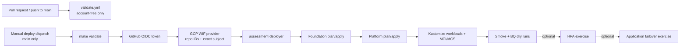

# Delivery and identity

## Delivery flow



`.github/workflows/validate.yml` has only `contents: read`, never requests an OIDC token, and runs `make tools` plus `make validate`. Deployment and teardown are manual-dispatch-only, reject refs other than `main`, serialize with the non-cancelling `assessment-production` concurrency group, and install Google Cloud CLI 582.0.0 with `gke-gcloud-auth-plugin` and `bq` after federation.

## Identity chain

The bootstrap provider admits only the immutable GitHub repository ID and owner ID plus the exact baseline subject:

```text
repo:OWNER/REPO:ref:refs/heads/main
```

GitHub's token is exchanged through the GCP Workload Identity Federation provider, then impersonates the single `assessment-deployer` Google service account. No service-account key is created or stored. Repository variables contain only non-secret project, provider, service-account, state-bucket, region, HTTPS, and DNS identifiers.

The one deployer identity is an assessment simplification. It has broad roles needed across foundation, platform, workloads, evidence checks, and teardown, so compromise or workflow misuse has a larger blast radius than a separated production design. A production evolution should split at least:

- bootstrap/state administration, held by a tightly controlled human or separate bootstrap pipeline;
- foundation/network/security deployment;
- platform/cluster/Fleet deployment;
- namespace-scoped workload deployment;
- read-only verification/evidence collection; and
- separately approved teardown.

Each identity should have purpose-built custom roles or the narrowest predefined roles, separate WIF subjects, protected environments, and independent approval paths. Those controls are recommendations; this repository implements exactly one federated deployer.

## Environment-subject hardening caveat

The baseline workflows do not name GitHub Environments, because GitHub changes the OIDC `sub` claim when a job references an Environment. Before adding `environment: production` or `environment: teardown` to any job, update `infra/bootstrap/wif.tf` and the bootstrap state contract to allow the exact Environment subjects, apply that WIF change safely, and only then change the workflow jobs. Reversing that order locks the workflows out.

See [ADR 0003](../adr/0003-single-oidc-identity.md), [GitHub hardening](../setup/github.md), and [IAM and secrets](../security/iam-and-secrets.md).
