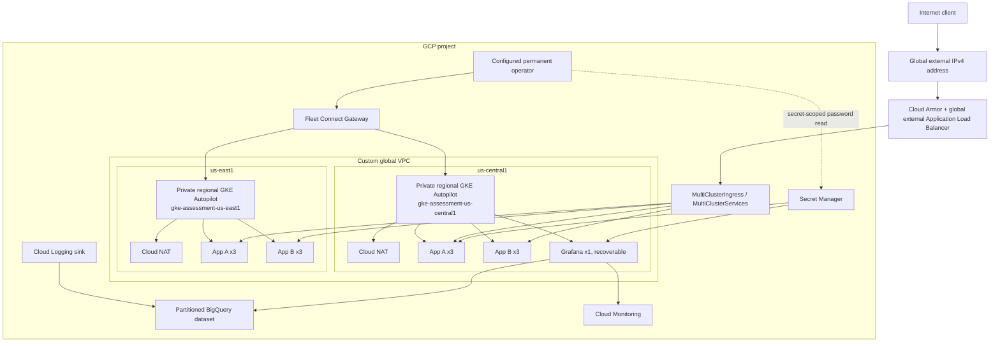
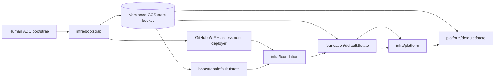

# Architecture overview

## Topology

Terraform owns the project/bootstrap boundary, shared VPC, per-region subnets and NAT, security and logging resources, two regional Autopilot clusters, Fleet registration, MCI/MCS feature enablement, and the exact operator's Gateway/password IAM grants. Kustomize owns Kubernetes namespaces, narrow pipeline RBAC, the exact-user operator `cluster-admin` bindings, regional workloads, and the MCI/MCS resources.

Each assessed application declares `replicas: 3` and an HPA baseline of `minReplicas: 3`, `maxReplicas: 10`, and 70% average CPU. The smoke script requires exactly three desired, ready, updated, and available replicas for App A and App B in each region: six ready replicas per application across the two clusters. Grafana is intentionally one recoverable replica in the primary cluster and is not part of the assessed application count.

## Network and access boundaries

- Each region has a dedicated subnet, Pod secondary range, Service secondary range, and control-plane CIDR. VPC flow logs sample 10% at a 10-minute aggregation interval.
- Cluster nodes are private. IP-based control-plane endpoints are disabled. Automation bootstraps access through the IAM-authorized GKE DNS endpoint, then uses Fleet Connect Gateway kubeconfigs for routine workload and verification access.
- The configured permanent operator uses a sanitized exact-user Connect Gateway kubeconfig for both clusters. Grafana stays `ClusterIP`; the supported UI path is a foreground port-forward bound only to workstation loopback, plus a separate exact-user, secret-scoped password read.
- Cloud NAT supplies private workload egress and records errors only. Private Google Access is enabled on each subnet.
- The external application path terminates at Google's global load balancer. Cloud Armor throttles each source IP at 100 requests per 60 seconds; SQL injection and XSS preconfigured WAF rules are present in preview, not enforcement.
- HTTP by reserved IP is the immediately deployable baseline. HTTPS requires an owned DNS name that resolves to that IP and a Google-managed certificate; [DNS/TLS setup](../setup/dns-tls.md) explains both managed-zone choices.

## Terraform state boundary

The roots deliberately form a one-way dependency chain: bootstrap outputs feed foundation; foundation outputs feed platform. Remote state uses the `bootstrap`, `foundation`, and `platform` GCS prefixes. Lifecycle scripts create same-job, mode-0600 Terraform plans and immediately apply them; plans are never uploaded. Teardown destroys only platform then foundation, leaving bootstrap and its bucket intact for controlled redeployment.

See [delivery and identity](delivery-and-identity.md), [traffic and observability](traffic-and-observability.md), and the [ADRs](../adr/0001-autopilot.md).
