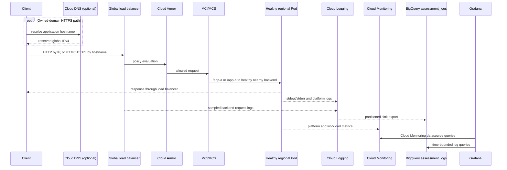

# Traffic and observability

## Request and telemetry flow

The MultiClusterIngress uses the Terraform-reserved global IPv4 address and path rules `/app-a` and `/app-b`. Both MultiClusterServices select Pods in both clusters. BackendConfigs define application-specific health paths, 30-second connection draining, 100% load-balancer log sampling, and the Cloud Armor policy. Google's controller creates the load-balancer resources; Terraform does not duplicate controller ownership.

For the HTTP baseline, smoke verification calls both paths at the reserved IP and requires 2xx while discarding response bodies. When HTTPS is enabled, it requires HTTP 3xx redirects, an `ACTIVE` Google-managed certificate, and HTTPS 2xx for both paths. DNS is optional for HTTP verification but required for the managed-certificate/HTTPS path.

## Observability boundary

GKE collects system, workload, API server, scheduler, and controller-manager logs and enables system/control-plane monitoring plus Managed Service for Prometheus. The project log sink routes Kubernetes, GKE control-plane, node, container, and HTTP load-balancer logs into the `assessment_logs` BigQuery dataset using partitioned tables. Dataset partitions expire after 30 days.

Committed SQL uses bounded `timestamp BETWEEN @start_time AND @end_time` predicates for six data queries against the partitioned log tables; the schema-discovery query is metadata-only. Smoke verification dry-runs all seven queries after authentication and waits for routed tables to exist. A dry run proves SQL validity and estimates processing, not that useful rows exist; actual redacted query results remain live evidence.

Grafana is a single recoverable Deployment in `us-central1` with ephemeral local data. Datasources and three dashboard exports are provisioned from ConfigMaps. The `Assessment overview` export contains the four required panels:

1. Application error rate
2. Pod restarts
3. Request latency p50/p95/p99
4. CPU and memory utilization

The export satisfies the assessment's dashboard-export alternative without pretending a live Grafana screenshot exists. Runtime health remains deployment evidence.

The two public demonstration images are not application source owned by this repository. They emit basic HTTP and container logs, but the repository cannot truthfully claim end-to-end application Trace, Profiler, or Error Reporting telemetry. Trace needs supported automatic capture or explicit instrumentation, Profiler needs a language-specific agent, and Error Reporting needs recognizable exception formatting or API reporting. See [security limitations](../security/limitations.md) and [official references](../references.md).
