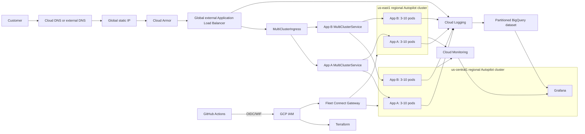

# GKE Assessment Platform Design

- **Date:** 2026-08-31
- **Status:** Approved for implementation
- **Deployment status:** Design and implementation artifacts only; no cloud resources will be created during repository development

## 1. Purpose

This repository will provide a deployment-ready implementation of the Schwab assessment architecture: two regional GKE clusters, two independently deployed web applications, multi-pod scaling, global traffic distribution, and an observable operating model backed by Terraform and GitHub Actions.

The assessment document is treated as source requirements, not as instructions that override the user's request. The user's direct constraints are authoritative:

- Do not deploy cloud resources now.
- Make the repository ready to deploy once a GCP account is available.
- Use GKE Autopilot.
- Use third-party Docker Hub application images instead of building application code.
- Run at least three replicas of each application in each cluster.
- Use the rubric-first MCI/MCS design and document a future migration to multi-cluster Gateway API.
- Include Grafana and provisioned dashboards.
- Make every important decision explainable, documented, and backed by primary sources.
- Make OIDC/WIF the only long-lived trust integration required between GitHub and GCP.
- Keep the implementation Terraform-first and avoid custom Python application or validation code.

## 2. Success Criteria

The implementation is successful when the proportionate account-free checks pass and a future operator can perform the following flow without changing repository code:

1. Supply a billing-enabled GCP project, or the billing and organization inputs needed to create one.
2. Authenticate once from a trusted workstation or Cloud Shell and run the bootstrap command.
3. Let bootstrap create the GCS Terraform state backend, GitHub OIDC Workload Identity Federation provider, and repository-scoped `assessment-deployer` pipeline identity.
4. Configure the generated non-secret GitHub repository variables using the supplied automation.
5. Trigger the manual deployment workflow from `main`.
6. Have that workflow plan, provision, deploy, verify, and publish non-secret evidence.
7. Reach both applications through the global load balancer and open the provisioned Grafana dashboard.
8. Run the separately guarded manual teardown workflow that removes billable resources in dependency order.

The one-time bootstrap requires a human GCP credential because no OIDC trust exists yet. After bootstrap, no service-account key or other long-lived cloud credential is stored in GitHub. The baseline OIDC subject is restricted to this repository's `main` branch. GitHub Environment protection and required reviewers are documented production hardening options, not deployment prerequisites.

An owned DNS domain is optional for the first HTTP verification. It is required to complete the managed-certificate and HTTPS-redirect portion of the architecture.

## 3. Scope

### Included

- Terraform for optional project creation, API enablement, remote state, IAM, networking, GKE, Fleet, MCI feature enablement, Cloud Armor, Cloud DNS inputs, logging, BigQuery, monitoring, and Secret Manager integration.
- Two regional GKE Autopilot clusters in `us-central1` and `us-east1`.
- Two third-party web applications deployed to both clusters through Kustomize.
- Three minimum replicas per application per cluster, HPA, disruption budgets, health probes, and topology spreading.
- Fleet membership, Kustomize-owned `MultiClusterService` and `MultiClusterIngress` resources, global static addressing, and an HTTPS enablement path.
- Self-hosted Grafana with provisioned data sources and multiple version-controlled dashboard exports.
- BigQuery log-export queries and a documented routed-log schema.
- Credential-free pull-request validation and manual deployment/teardown workflows.
- Requirement traceability, architecture diagrams, ADRs, setup guides, runbooks, cost analysis, security analysis, troubleshooting, evidence capture, and an interview guide.

### Excluded from the baseline

- Executing any GCP deployment during repository development.
- Custom application source code or container builds.
- A service mesh; the selected applications do not require application-level east-west mTLS or traffic shaping.
- Enforced Binary Authorization attestations for third-party Docker Hub images. A migration path will be provided for mirroring, signing, and enforcing trusted images.
- Claims that Cloud Trace or Cloud Profiler contain useful data when the third-party applications are not instrumented.
- A highly available Grafana database. Grafana is configuration-as-code and recoverable; the assessed applications, rather than the dashboard UI, are the multi-region workloads.
- Stateful application services such as Cloud SQL, Memorystore, or Pub/Sub. The assessment presents these as application-B options, not mandatory dependencies.
- Python, pytest, Python-backed lint tooling, custom validation frameworks, and custom policy engines. A small set of standard Terraform, Kubernetes, shell, JSON, and workflow checks is sufficient for this assessment.

### Delivery priority

The first implementation milestone contains every objectively assessed artifact: reproducible infrastructure, two clusters, both applications at three replicas per cluster, MCI/MCS, Grafana dashboards, BigQuery queries, troubleshooting, documentation, proportionate standard validation, and deployment/teardown automation. Feature-gated Backup for GKE, signed-image Binary Authorization enforcement, service mesh integration, and Gateway migration are follow-on controls. Their paths are documented without delaying the deployable assessment baseline.

## 4. Considered Approaches

### Selected: rubric-first GitHub Actions with MCI/MCS

Terraform manages cloud infrastructure, Kustomize manages Kubernetes resources, and small Bash/Make entrypoints plus GitHub Actions perform standard validation and future push-based deployment. MCI/MCS matches the assessment language directly. This approach has the smallest operational surface that still demonstrates infrastructure, delivery, security, high availability, observability, and recovery.

### Not selected: multi-cluster Gateway API as the initial implementation

Multi-cluster Gateway is the more Kubernetes-native long-term interface and supports capabilities such as traffic splitting and mirroring. It is not selected initially because the assessment explicitly names MCI/MCS. The repository will contain an ADR and migration plan so the design does not imply that MCI is the permanent strategic choice.

### Not selected: Argo CD or another pull-based reconciler

A reconciler would provide stricter GitOps semantics, but it adds controllers, bootstrap dependencies, RBAC, upgrades, and failure modes that are not required by the assessment. The selected Git-driven, push-based workflow remains declarative and reviewable without creating a second delivery platform.

## 5. Logical Architecture

## 6. Infrastructure Boundaries

Terraform uses separate root modules and state boundaries so bootstrap credentials, shared infrastructure, and cluster lifecycle do not become one inseparable state file.

### `bootstrap`

- Optionally creates the project when organization, folder, and billing inputs are supplied; otherwise it attaches to an existing project.
- Creates a versioned, uniform-access, public-access-prevented GCS state bucket with `force_destroy = false`.
- Creates GitHub external Workload Identity Federation, repository-scoped attribute conditions, and one `assessment-deployer` service account used by plan, apply, Kubernetes delivery, verification, and teardown jobs.
- Produces non-secret outputs used to configure GitHub repository variables.
- Starts with local state or an approved organization bootstrap backend, then migrates its state into the new GCS backend.

### `foundation`

- Enables required APIs.
- Creates one custom-mode VPC.
- Creates a regional subnet and non-overlapping Pod/Service secondary ranges for each cluster.
- Enables Private Google Access and one Cloud Router/NAT pair per region, including NAT logging.
- Reserves the global IP and optionally manages Cloud DNS records and certificates.
- Creates Cloud Armor, Secret Manager containers, the BigQuery dataset, and the Logging sink.
- Creates IAM bindings from supplied principal sets for Dev, Ops, and SRE, plus narrow App A and Grafana runtime identities. Bootstrap remains the sole owner of the combined CI pipeline permissions so routine teardown cannot delete its own caller or create cross-state IAM drift.

### `platform`

- Creates the two regional Autopilot clusters.
- Registers both as regular members of one Fleet.
- Enables the managed MCI feature only after both memberships exist and selects `us-central1` as the configuration membership.
- Configures cluster-level Workload Identity, logging, monitoring, the Secret Manager managed add-on, and required platform IAM.
- Exposes outputs needed by the deployment workflow without storing kubeconfig credentials.

Kubernetes objects remain outside Terraform. Kustomize owns Deployments, Services, RBAC, `MultiClusterService`, `MultiClusterIngress`, `BackendConfig`, `FrontendConfig`, and their cluster-specific overlays. Terraform owns the GKE/Fleet APIs and managed MCI feature configuration as well as the global IP, SSL policy, and optional Compute Google-managed certificate referenced by MCI. MCI does not support declarative Kubernetes `ManagedCertificate` creation. This keeps cloud-resource state independent of workload rollout, avoids a Kubernetes provider dependency during cluster creation, and permits application rollback without manipulating Terraform state.

## 7. Networking and Traffic

- Both clusters use private nodes and private control planes.
- The public IPv4 control-plane endpoint is disabled; the DNS endpoint and IAM-aware access are enabled.
- GitHub-hosted runners reach Kubernetes through Fleet Connect Gateway, avoiding public control-plane exposure and dynamic runner IP allowlists.
- Regional Cloud NAT provides controlled egress for Docker Hub image pulls and Grafana plugin installation.
- MCS resources explicitly name only the two assessment Fleet memberships instead of implicitly selecting every future Fleet cluster.
- The same application namespace and label contract is used in both clusters.
- MCI creates a global external Application Load Balancer and routes `/app-a` and `/app-b` to separate backends.
- A preallocated global static IPv4 address exists before MCI configuration.
- Cloud Armor attaches to MCI backends with baseline WAF and rate-limiting rules. High false-positive-risk managed rules start in preview and have a documented promotion procedure.

HTTPS is intentionally staged:

1. Deploy and verify HTTP at the reserved IP.
2. Point an owned domain to the IP and attach the Terraform-created Google-managed certificate to MCI without redirect.
3. Wait for the attached certificate to become `ACTIVE`, prove direct HTTPS, and only then enable HTTPS redirect and the minimum TLS policy through `FrontendConfig`.

This ordering avoids a certificate deadlock and still provides an immediately verifiable endpoint when a domain is not yet available.

## 8. Workloads

### Application A

- Uses the NGINX-maintained unprivileged Docker Hub image repository.
- Receives server configuration and page content from a ConfigMap.
- Demonstrates a Secret Manager CSI mount through a protected path while keeping the public health and demonstration endpoints accessible.
- Runs as a non-root user with privilege escalation disabled, capabilities dropped, a read-only root filesystem where compatible, and a writable temporary volume only where required.

### Application B

- Uses Traefik's lightweight `whoami` Docker Hub image repository.
- Exposes pod identity and request metadata, making cross-cluster and rolling-update behavior easy to demonstrate.
- Uses the same hardened security posture where supported by the upstream image.

### Shared workload controls

- Images use canonical `docker.io` names and immutable SHA-256 digests; tags are rejected by policy.
- `replicas: 3` is the declarative baseline in each cluster.
- HPA uses `minReplicas: 3`, `maxReplicas: 10`, and a CPU target that will be documented with the selected resource requests.
- The PodDisruptionBudget requires at least two available replicas.
- Rolling updates use no voluntary unavailability and a bounded surge.
- Readiness, liveness, and startup behavior are explicit.
- Zone and hostname topology-spread constraints reduce correlated placement.
- Resource requests and limits use Autopilot-compatible ratios.
- Services are `ClusterIP`; internet exposure occurs only through the MCI-managed load balancer.

Final digests are selected during implementation after compatibility and immutable-digest resolution checks and then committed to the repository-owned inventory. An optional advisory security scan is available for reviewers who want the additional signal, but it is not an assessment gate.

## 9. Identity, Secrets, and Supply Chain

Two identity systems remain deliberately separate:

- GitHub OIDC to Google Cloud external WIF authenticates CI jobs.
- GKE Workload Identity authenticates Kubernetes ServiceAccounts to Google APIs.

The WIF provider condition binds trust to immutable GitHub repository and owner IDs and the exact `repo:<OWNER/REPO>:ref:refs/heads/main` subject. All privileged pipeline jobs impersonate the same `assessment-deployer` service account. Kubernetes authorization remains separate from Connect Gateway IAM: the pipeline receives namespace-scoped workload RBAC on both clusters plus the platform RBAC required to administer MCI objects on the configuration cluster. Immediately after cluster creation, the workflow uses each IAM-aware DNS endpoint once with an ephemeral kubeconfig to install the narrowly resource-named Connect Gateway impersonation policy; all subsequent workload delivery and verification uses Connect Gateway. This avoids a circular dependency in which the gateway would be required to install its own initial authorization.

Using one pipeline identity is an intentional assessment simplification. It reduces OIDC, IAM, Terraform, GitHub-variable, and troubleshooting overhead, but its union of plan, infrastructure mutation, workload deployment, verification, and teardown permissions creates a larger blast radius than a production separation-of-duties model. The compensating controls are short-lived OIDC credentials, immutable repository-ID trust, no OIDC permission in pull-request validation, `main`-only manual deployment, full-SHA Action pinning, concurrency controls, and auditable workflows. The identity ADR will recommend protected GitHub Environments plus separate read-only planner, infrastructure deployer, namespace workload deployer, and tightly controlled teardown or break-glass identities for production.

No service-account JSON key, static kubeconfig, secret value, or Terraform plan file is stored in GitHub. Secret containers and IAM are managed by Terraform; secret versions are created directly in Secret Manager by a guarded manual workflow or authorized operator so values do not enter Terraform state. Grafana uses `roles/monitoring.viewer`, dataset-scoped BigQuery read access, and project-level BigQuery job execution through Workload Identity.

Digest pinning guarantees immutable selection but does not prove publisher identity or vulnerability status. The baseline therefore combines:

- A reviewed Docker Hub repository allowlist.
- Digest-only manifests.
- Registry resolution checks.
- Full-SHA pinning for third-party GitHub Actions.
- Dependency update automation that opens reviewed changes rather than silently moving versions.

`make security-scan` offers an optional, advisory Trivy scan of the Terraform, Kubernetes, and pinned images. It is deliberately excluded from required pull-request and deployment gates because the assessment does not ask for a vulnerability-management program. A production adoption would define ownership, severity thresholds, exception lifetimes, and an approved image-mirroring policy before making scan results blocking.

Binary Authorization is provided as a documented future control. Enforcement begins only after images are mirrored into Artifact Registry, signed or attested under an owned policy, and verified in a non-production mode. Public images will not be misleadingly described as organization-attested.

## 10. Observability

### Collection and storage

- Autopilot system metrics and logs remain enabled. Cluster logging explicitly includes `SYSTEM_COMPONENTS`, `WORKLOADS`, `APISERVER`, `SCHEDULER`, and `CONTROLLER_MANAGER`.
- Load-balancer request logging is enabled because it supplies structured HTTP status and latency fields without changing the third-party applications.
- A filtered Logging sink routes load-balancer requests, application container logs, GKE node logs (`k8s_node`), GKE control-plane component logs (`k8s_control_plane_component`), and relevant cluster/audit records to a dedicated BigQuery dataset. Application logs can be severity-filtered; node and control-plane classes remain explicitly represented so the assessment queries can prove each required source.
- Logging uses partitioned tables and the dataset applies a default partition expiration to limit retention and cost.
- Every sample and dashboard query includes a timestamp partition predicate.
- Post-deployment verification discovers the generated tables and runs one bounded query for application, node, control-plane, and load-balancer log classes.

### Grafana

Grafana runs as a single, recoverable, configuration-as-code deployment in the primary cluster. It is a `ClusterIP` service and is accessed through an authenticated port-forward by default, avoiding a second public administrative endpoint. Its official Docker Hub image, BigQuery plugin version, data sources, folders, and dashboards are pinned and provisioned from repository artifacts.

The baseline provisions three dashboards:

1. **Assessment overview:** contains the four panels required by the assessment.
2. **Multi-cluster operations:** focuses on ready replicas, pod restarts, HPA state, workload placement, and regional health.
3. **Traffic and log analysis:** focuses on request volume, response classes, latency, Cloud Armor outcomes, and BigQuery log exploration.

The assessment overview dashboard includes at least these four panels:

1. **Application error rate:** BigQuery query over structured load-balancer logs, calculated as HTTP 5xx responses divided by total requests and grouped by application path and time.
2. **Pod restarts:** Cloud Monitoring `kubernetes.io/container/restart_count`, grouped by namespace and workload.
3. **Request latency:** p50, p95, and p99 from the load balancer's distribution-valued backend latency metric.
4. **Resource utilization:** Cloud Monitoring GKE container CPU and memory trends.

Dashboard variables cover cluster, region, namespace, and application. The committed dashboard JSON files are assessment-ready exports. A live screenshot is not fabricated; the evidence runbook explains how to capture one after deployment.

A dedicated `observability/grafana` Kubernetes ServiceAccount impersonates a narrowly scoped Google service account through GKE Workload Identity. The service account receives `roles/monitoring.viewer`, dataset-scoped `roles/bigquery.dataViewer`, project-scoped `roles/bigquery.jobUser`, and the minimum project-read permission required by the data-source plugins. Both data sources use Google metadata-server (`gce`) authentication. Post-deployment verification proves BigQuery and Monitoring queries work and confirms that no service-account key file is mounted.

Cloud Trace, Profiler, and application-internal metrics are documented as instrumentation boundaries. The APIs may be enabled, but the repository will not claim useful application traces or profiles from images that do not emit them.

## 11. Delivery Workflows

### Credential-free validation

`.github/workflows/validate.yml` runs for pull requests and pushes to `main` with `contents: read` and no OIDC permission. It performs:

- Terraform formatting, `init -backend=false`, and `terraform validate` for every root.
- Kustomize rendering for every overlay followed by Kubeconform validation for resources with available schemas.
- `jq empty` syntax validation for every committed Grafana dashboard export.
- `bash -n`, ShellCheck, and actionlint; BigQuery validates the sample SQL with authenticated dry runs during post-deployment verification.

These lightweight checks catch malformed deliverables without turning validation into a separate project. Assessment-specific facts such as replica counts, HPA bounds, dashboard inventory, and required panels remain explicit, reviewable configuration and are confirmed by the post-deployment workflow. The pull-request workflow is not described as a Terraform plan because it cannot query live GCP APIs or state without an account.

### One-time bootstrap

A documented `make bootstrap` entry point runs the bootstrap Terraform root under a human's Application Default Credentials. It outputs the non-secret GitHub repository variables for the generated WIF provider and single `assessment-deployer` service account. The operator can set them with the documented GitHub CLI commands or repository UI; no protected Environment is required by the baseline.

The bootstrap is the only unavoidable initial trust step. Routine workflows use OIDC and do not require stored cloud secrets.

### Manual deployment

`.github/workflows/deploy.yml` is `workflow_dispatch` only and rejects refs other than `main`.

- Plan and apply jobs impersonate the same `assessment-deployer` identity through OIDC.
- Each Terraform stack job displays a redacted structural plan summary and then applies the same job-local saved plan; IAM cannot enforce command-level separation when both operations share one account.
- GitHub concurrency prevents overlapping production applies; GCS state locking remains authoritative.
- The workflow applies the job-local saved plan produced by its immediately preceding plan command.
- Saved Terraform plans are not uploaded because they can contain sensitive values.
- Workloads are deployed through Connect Gateway.
- The workflow waits for rollouts, verifies three ready replicas per application per cluster, checks MCI backend health, tests both routes, validates HTTPS when enabled, checks BigQuery ingestion, and validates Grafana provisioning.
- Non-secret evidence and precise commands for retrieving protected data are published at the end.

### Manual teardown

`.github/workflows/teardown.yml` requires the exact project ID and typed confirmation. It removes MCI and workload resources first, waits for managed load-balancer cleanup, and then destroys platform and foundation states in reverse order. The bootstrap state bucket and trust configuration remain until an administrator deliberately performs final decommissioning. A protected Environment with required reviewers is the documented production recommendation.

## 12. Failure Handling and Recovery

- Readiness and load-balancer health checks remove an unhealthy pod or region from service.
- The three-replica baseline, HPA, disruption budget, and topology spread protect rolling maintenance and pod failure scenarios.
- Loss of the MCI configuration cluster does not interrupt an already programmed load balancer, but reconciliation pauses; the runbook distinguishes data-plane availability from control-plane management.
- Certificate activation uses a bounded workflow wait rather than being assumed immediate.
- Docker Hub digest-resolution or image-pull failures stop deployment. A future Artifact Registry mirror is the mitigation for registry availability and rate limits.
- Deployment stops on failed rollout or smoke tests and does not continue to later verification stages.
- Normal application rollback redeploys a reviewed last-known-good Git commit and immutable digests through the manual deployment workflow.
- `kubectl rollout undo` is an emergency action followed immediately by a Git reconciliation change.
- Terraform resources are corrected forward. GCS object versioning is state-disaster recovery, not a routine rollback mechanism.
- Teardown ordering prevents orphaned MCI load balancers and network endpoint groups.

## 13. Validation and Evidence Model

### Account-free evidence

- Terraform format and validation output.
- Rendered Kubernetes manifests and Kubeconform results for recognized schemas.
- Reviewable workload manifests containing the three-replica, HPA, and disruption-budget settings.
- A resolved immutable image inventory; optional advisory Trivy output may be attached when requested.
- Syntactically valid Grafana dashboard JSON and reviewable dashboard exports.
- BigQuery SQL files ready for authenticated dry-run validation after OIDC is configured.
- Shell and workflow lint output.

### Post-deployment evidence

- Terraform plan/apply summaries and resource identifiers that contain no secrets.
- Fleet and cluster readiness output.
- Three ready pods per application per cluster.
- HTTP and optional HTTPS endpoint results for both paths.
- MCI backend health and a controlled regional failover exercise.
- HPA response to generated load.
- BigQuery table/schema discovery and sample query results.
- Grafana screenshots in addition to the committed exports.
- IAM negative tests and Secret Manager mount verification.
- Teardown result and residual-resource check.

Evidence that requires a GCP account is marked `deployment evidence pending` rather than invented. The committed dashboard JSON already satisfies the assessment's "screenshot or export" alternative.

## 14. Troubleshooting Scenario

The repository includes a reproducible controlled exercise that introduces an invalid readiness probe path. The exercise records:

1. The symptom: pods run but never become Ready, leaving no healthy service endpoints.
2. Initial evidence from Deployment conditions, pod status, events, endpoint slices, and container logs.
3. The hypothesis and rejected alternatives.
4. The root cause: health-check path mismatch.
5. The manifest correction.
6. Verification that all three replicas become Ready and the service answers.
7. Cleanup and prevention through explicit readiness probes plus Kubeconform and rendered-manifest review.

It is labeled as a controlled troubleshooting drill. After a real GCP deployment, the same structure records any actual MCI, certificate, IAM, or observability issue without rewriting history.

## 15. Documentation Deliverables

The final repository documentation includes:

- `README.md` for orientation and the shortest safe path to validation and deployment.
- The preserved assessment source under a correctly named documentation path.
- A requirement-to-code-to-test-to-evidence traceability matrix.
- Architecture, customer-traffic, observability, identity, CI/CD, and teardown diagrams.
- Setup guides for prerequisites, bootstrap, GitHub settings, deployment, DNS/TLS, verification, and teardown.
- ADRs for Autopilot, MCI versus Gateway, public images, push-based delivery, observability data sources, Grafana hosting, secrets, Binary Authorization deferral, and cost.
- Security threat model, IAM matrix, supply-chain policy, and documented limitations.
- Operations runbooks for rollout, rollback, scaling, secret rotation, failover, dashboard use, and disaster recovery.
- BigQuery schema notes and executable sample queries.
- Grafana provisioning instructions and dashboard interpretation.
- Cost model and cost-control checklist.
- Evidence checklist with commands and honest status labels.
- An interview guide containing an architecture walkthrough, decision rationale, trade-offs, likely questions, and production evolution.

Documentation is reviewed alongside the implementation, while the machine-readable Terraform, YAML, workflow, SQL, and dashboard artifacts are checked by their standard validators.

## 16. Cost and Free-Tier Position

The design is not represented as free. At the current standalone MCI rate of approximately $3 per direct backend pod per month, two applications multiplied by three pods multiplied by two clusters create twelve minimum backend pod memberships, or approximately $36/month for MCI alone. Cluster management, Autopilot compute, the global load balancer, NAT, logging, BigQuery, DNS, and egress are additional.

Cost controls include:

- Explicit deployment and teardown rather than automatic cloud creation.
- Narrow log sinks and partition expiration.
- Partition-bounded dashboard queries.
- Small Autopilot-compatible resource requests.
- No service mesh, stateful database, or duplicate Grafana deployment.
- A guarded teardown workflow and residual-resource check.
- Optional features, including Backup for GKE and enforced Binary Authorization, disabled until intentionally selected.

## 17. Future Migration to Multi-cluster Gateway

The migration ADR will recommend Gateway API for a long-lived platform because it is Kubernetes-native and provides richer traffic policy. The migration sequence is:

1. Keep the existing application `Service` resources, but replace each proprietary MCI `MultiClusterService` with a standard `ServiceExport` in both workload clusters and wait for the corresponding `ServiceImport` to appear.
2. Add a global external multi-cluster `Gateway` and `HTTPRoute` resources in parallel with MCI under a separate hostname and static address.
3. Reattach Cloud Armor and health configuration through `GCPBackendPolicy` and `HealthCheckPolicy` objects that target each `ServiceImport`; do not assume MCI `BackendConfig` objects are reusable.
4. Validate route ownership, ServiceImport membership, path routing, regional failover, TLS, logs, metrics, policy attachment, and cost.
5. Shift DNS with a reduced TTL while preserving the MCI address and manifests as the rollback path.
6. Observe both paths during a defined rollback window, then remove MCI resources only after Gateway acceptance evidence passes and a DNS rollback has been tested.

This is documented but not implemented in the baseline so the assessment remains focused and rubric-aligned.

## 18. Requirement Traceability Summary

| Assessment expectation | Designed artifact | Pre-deployment status |
|---|---|---|
| Working cluster and accessible endpoint | Terraform, MCI/MCS, Kustomize, deploy and smoke-test workflow | Deployment evidence pending |
| Two GKE clusters | Two regional Autopilot cluster resources and Fleet memberships | Terraform configuration and validation available |
| Two applications in both clusters | Two external images, two overlays, three replicas each | Kustomize/Kubeconform validation available |
| Scalable multi-pod workloads | Deployments, HPA 3-10, PDB, topology spread | Reviewable rendered manifests; live replica evidence pending |
| Global traffic and failover | Static IP, MCI, two explicit MCS backends, health checks | Deployment evidence pending |
| Grafana dashboards | Provisioned Grafana and three committed dashboard JSON exports | JSON validation available |
| Four required overview panels | BigQuery error rate; Monitoring restarts, latency, CPU/memory | Committed dashboard export and SQL available; live data pending |
| BigQuery log analysis | Partitioned sink design, schema guide, executable SQL for application, node, control-plane, and load-balancer logs | SQL templates committed; authenticated dry-run and live schema pending |
| Troubleshooting scenario | Controlled readiness failure drill and post-deploy incident template | Deployment runbook; live evidence pending |
| Reproducible Terraform | Bootstrap, foundation, and platform roots | Format and configuration validation available |
| Architecture and setup documentation | Diagrams, setup guides, ADRs, runbooks, interview guide | Repository deliverables |
| Security controls | Private clusters, WIF, Secret Manager, Cloud Armor, image policy | Reviewable configuration; live IAM tests pending |
| Cloud Trace and Profiler | APIs and integration boundary documented; third-party apps are not falsely described as instrumented | Explicit baseline limitation and future OpenTelemetry path |
| Error Reporting | Cloud Logging integration and verification query documented; useful error groups depend on compatible application exceptions | Live behavior pending; limitation traced |

## 19. Primary References

- [Choose a GKE mode](https://cloud.google.com/kubernetes-engine/docs/concepts/choose-cluster-mode)
- [Regional GKE clusters](https://cloud.google.com/kubernetes-engine/docs/concepts/regional-clusters)
- [Multi Cluster Ingress architecture](https://cloud.google.com/kubernetes-engine/docs/concepts/multi-cluster-ingress)
- [Multi Cluster Ingress setup](https://cloud.google.com/kubernetes-engine/docs/how-to/multi-cluster-ingress-setup)
- [Choose a multi-cluster load-balancing API](https://cloud.google.com/kubernetes-engine/docs/concepts/choose-mc-lb-api)
- [Configure multi-cluster Services](https://cloud.google.com/kubernetes-engine/docs/how-to/multi-cluster-services)
- [Configure Gateway backend policies](https://cloud.google.com/kubernetes-engine/docs/how-to/configure-gateway-resources)
- [Fleet Connect Gateway](https://cloud.google.com/kubernetes-engine/enterprise/multicluster-management/gateway)
- [GKE Workload Identity Federation](https://cloud.google.com/kubernetes-engine/docs/how-to/workload-identity)
- [Workload Identity Federation for deployment pipelines](https://cloud.google.com/iam/docs/workload-identity-federation-with-deployment-pipelines)
- [Workload Identity Federation best practices](https://cloud.google.com/iam/docs/best-practices-for-using-workload-identity-federation)
- [Secret Manager add-on for GKE](https://cloud.google.com/secret-manager/docs/secret-manager-managed-csi-component)
- [Terraform GCS backend](https://developer.hashicorp.com/terraform/language/backend/gcs)
- [Terraform validation](https://developer.hashicorp.com/terraform/cli/commands/validate)
- [Cloud Logging routed to BigQuery](https://cloud.google.com/logging/docs/export/bigquery)
- [Load-balancer metrics for SLIs](https://cloud.google.com/stackdriver/docs/solutions/slo-monitoring/sli-metrics/lb-metrics)
- [Grafana BigQuery data source](https://grafana.com/docs/plugins/grafana-bigquery-datasource/latest/configure/)
- [GitHub OIDC for Google Cloud](https://docs.github.com/en/actions/how-tos/secure-your-work/security-harden-deployments/oidc-in-google-cloud-platform)
- [GitHub deployment environments](https://docs.github.com/en/actions/reference/workflows-and-actions/deployments-and-environments)
- [Kubernetes image digests](https://kubernetes.io/docs/concepts/containers/images/)
- [GKE pricing](https://cloud.google.com/kubernetes-engine/pricing)

## 20. Design Acceptance

Implementation must preserve the following non-negotiable properties:

- No cloud deployment occurs during repository development.
- Three is the minimum application replica count in each cluster and in every rendered production overlay.
- The repository contains working Grafana provisioning, three dashboard exports, and the four required panels on the assessment overview.
- OIDC/WIF replaces stored Google Cloud keys after a single documented bootstrap.
- Exactly one GitHub-federated `assessment-deployer` service account handles plan, apply, workload delivery, verification, and teardown; the documented production recommendation splits these duties.
- A future operator can deploy, verify, collect evidence, roll back, and tear down through documented commands and manual workflows.
- Evidence is never fabricated; live-only outcomes are explicitly marked until observed.
- Every material trade-off is recorded with consequences and primary references.
- The minimum-three replica rule applies to the two assessed web applications in both clusters; Grafana is a recoverable platform tool and is not counted as an assessed application replica set.
- Before the repository is called deploy-ready, it commits concrete image and Action digests, Terraform/tool/Grafana/plugin versions, probe ports and paths, resource requests and limits, and the HPA CPU target. Standard account-free checks cover Terraform, recognized manifest schemas, workflows, shell, and dashboard JSON; the optional advisory scan and authenticated BigQuery dry runs retain their explicitly documented boundaries.
